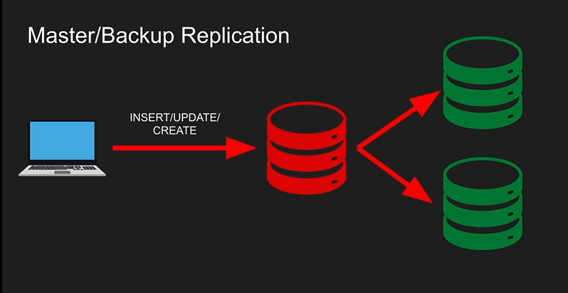

# Database Replication

## Master/Standby replication

It is also known as master-backup replication. It has:
- One master node that accepts writes and DDLs (Data Definition Language).
- There will be many read-only or standby nodes who receive those writes from the maaster. (You (the client) does not write to the standby nodes directly, you write to the master and it writes to the backup nodes.).
- Simple to implement (no conflicts)
- When you read, you can read against both master and replicas (eventual consistency)

## Muli-master replication

It is more complicated than the master-backup architecture (conflicts may easily arise). Hence most databases prefer the master-standby architecture. Multi-master architecture:
- Multiple master/leader nodes that accepts writes and DDLs
- One or more backup/follower nodes that receive the write requests.
- Need to resolve conflicts

## Synchronous vs. Asynchronous replication

In Synchronous replicatoin, a write transaction to the master is blocked until it is written to the backup/standby nodes. If you have several backup nodes, it is also customizable to say unblock the clients when the (e.g.) first two backup nodes are synchronized. Here you get full consistency.

In Asynchronous replication, a write transaction is considered successful if it is written to the master. Then the writes to the backup nodes are applied asynchronously.
